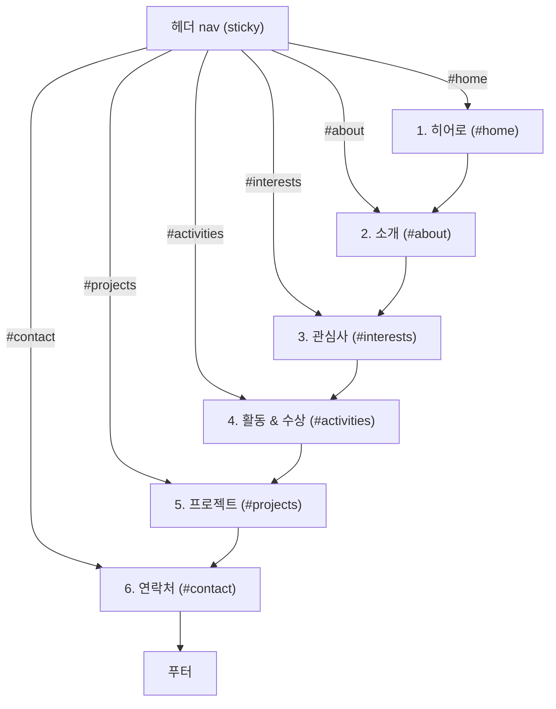

# 사이트맵 (단일 페이지 구조)

이 사이트는 페이지가 여러 개가 아니라 `index.html` 한 페이지 안에서 헤더의 앵커 링크로
각 섹션을 이동하는 구조다. 아래는 헤더 내비게이션과 섹션 간 계층 관계, 그리고 섹션별
필수요소를 정리한 문서다.

## 1. 계층 구조

- 헤더 nav는 모든 섹션에서 항상 보이는 상위 계층(고정 내비게이션)이며, 6개 메뉴가
  본문의 6개 섹션과 1:1로 대응한다.
- 본문은 위에서 아래로 읽는 단일 흐름이며, 별도 하위 페이지나 depth 2 이상의 구조는 없다.
- 헤더 메뉴 순서 = 본문 섹션 등장 순서로 항상 일치시킨다 (사용자가 nav로 예상한 위치에
  실제 섹션이 오도록).

## 2. 배치·순서 근거

| 순서 | 섹션 | 배치 이유 |
|---|---|---|
| 1 | 히어로 | 첫 화면에서 "누구인지"를 즉시 전달 (이름 + 한줄소개) |
| 2 | 소개 | 히어로에서 압축한 내용을 문단으로 풀어 설명 |
| 3 | 관심사 | 짧고 스캔하기 쉬운 태그로, 소개를 읽은 뒤 가볍게 훑도록 배치 |
| 4 | 활동 & 수상 | 관심사 다음에 실제 활동 이력(시간순)으로 신뢰도 보강 |
| 5 | 프로젝트 | 가장 구체적인 결과물/추천 아이디어로, 방문자가 오래 머무는 핵심 콘텐츠를 뒤쪽 하이라이트로 배치 |
| 6 | 연락처 | 모든 내용을 본 뒤 마지막에 오는 행동 유도(CTA) 위치 |
| - | 푸터 | 저작권 등 부가 정보로 흐름 종료 |

## 3. 섹션별 필수요소

### 헤더 nav (모든 섹션 공통, sticky)
- [ ] 사이트/이름 로고 텍스트
- [ ] 6개 앵커 링크 (홈·소개·관심사·활동·프로젝트·연락처), 본문 섹션과 순서 일치
- [ ] 좁은 화면에서 줄바꿈되는 반응형 처리

### 1. 히어로 `#home`
- [ ] 아바타 (실제 사진 대신 이니셜 등 placeholder)
- [ ] 이름
- [ ] 한줄소개(태그라인)

### 2. 소개 `#about`
- [ ] 섹션 제목(`<h2>`)
- [ ] 자기소개 본문 문단
- [ ] 소속 상태 (특정 학교명 없이 일반화된 표현)
- [ ] 희망 진로 한 줄

### 3. 관심사 `#interests`
- [ ] 섹션 제목(`<h2>`)
- [ ] 관심사/특기 태그 목록 (최소 1개 이상)

### 4. 활동 & 수상 `#activities`
- [ ] 섹션 제목(`<h2>`)
- [ ] 타임라인 항목 목록: 날짜 + 활동/수상 설명, 최신순 정렬

### 5. 프로젝트 `#projects`
- [ ] 섹션 제목(`<h2>`)
- [ ] 섹션 설명 문구 (완료작인지 추천 아이디어인지 구분되는 안내)
- [ ] 프로젝트 카드 목록: 제목 + 한줄 설명, 카드 그리드로 배치

### 6. 연락처 `#contact`
- [ ] 섹션 제목(`<h2>`)
- [ ] 연락 안내 문구 (실제 이메일/SNS 대신 안내 문구)

### 푸터
- [ ] 저작권/버전 표기 문구
